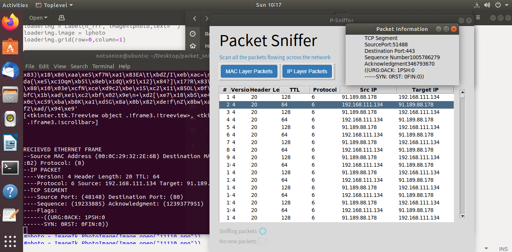

# Packet-Sniffer
Packet Sniffing, also referred to as Network Monitoring , Network Analysis or Packet Analysis is a technique through which we capture all the data packets flowing across in a network. It is used for capturing,monitoring, analysing and logging all incoming and outgoing traffic in the network.
The underlying functionality is the same as of buckyroberts(thenewboston)

This program is only runnable on linux because linux allows raw packets to be read. For more info refer to 
https://stackoverflow.com/questions/38406741/attributeerror-module-socket-has-no-attribute-af-packet

Here is an snapshot of the program running.

## How to Run
To run type "python3 packet_sniffer.py"

The required libraries for this program are
- socket
- tkinter
- thread
- PIL
